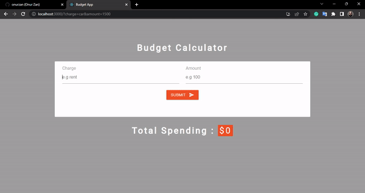

<h1>Budget Calculator App with React.js</h1>

The main purpose of this project is to keep the entered items in localstroage and to have the ability to edit and delete these items as we wish. It is also available for total to add and subtract added prices. In this project, React Hooks is experienced and the concepts of "useState" and "useEffect" are understood.

<h2>Used Techs</h2>

React.js Libraries and CSS3

